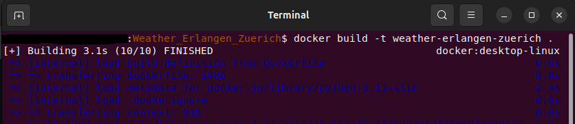
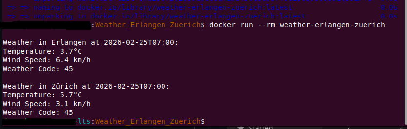

# 🌦 Weather Erlangen & Zürich (Docker CLI App)

A simple Dockerized Python CLI application that fetches current weather data 
for Erlangen 🇩🇪 and Zürich 🇨🇭 using the Open-Meteo API (no API key required).

---

## Features

-  No API key required (uses Open-Meteo)
-  Fully Dockerized
-  CLI-based output
-  Environment-variable support
-  Lightweight & clean setup

---

## Technologies Used

- Python 3
- Docker
- Requests library
- Open-Meteo API (free, no key required)

---

##  Project Structure

Weather_Erlangen_Zuerich/
│
├── Dockerfile
├── requirements.txt
├── main.py
├── .env (optional)
└── .gitignore


---

## Build the Docker Image and Run
```bash
docker build -t weather-erlangen-zuerich .
docker run --rm weather-erlangen-zuerich
```
## Screenshots

### Screenshot 1


### Screenshot 2

---

#  MIT License
